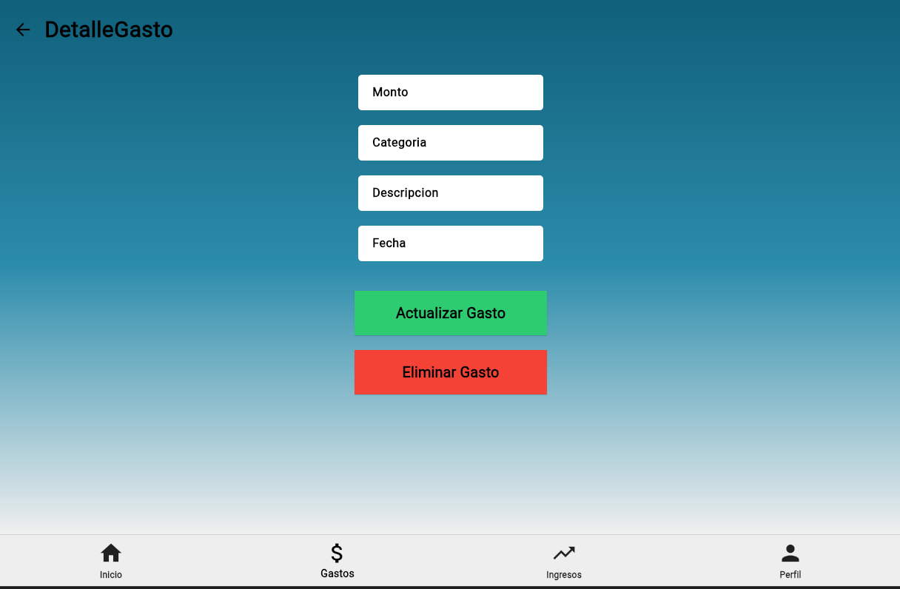
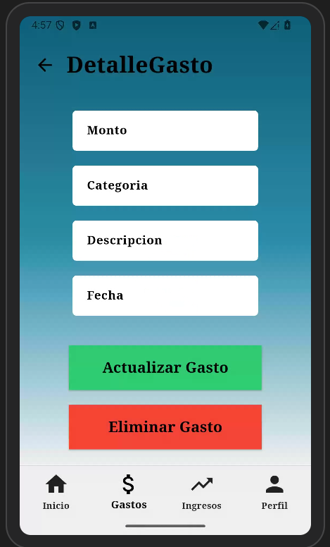

# PROMTP
Necesito que crees una pantalla en Flutter usando Dart que sea idéntica a la que aparece en la imagen que te proporcioné. El diseño debe verse lo más parecido posible.

La pantalla debe tener un fondo con un degradado azul que se va desvaneciendo hacia blanco, empezando más oscuro en la parte superior y más claro hacia abajo.

En la parte superior debe aparecer un icono de flecha hacia atrás a la izquierda y al lado el texto “DetalleGasto” con un tamaño de letra grande.

Debajo del título debe haber cuatro campos de texto para ingresar información. Los campos deben ser:

Monto

Categoria

Descripcion

Fecha

Los campos deben verse como cajas blancas con bordes, alineadas verticalmente y con espacio entre cada una.

Debajo de los campos deben aparecer dos botones grandes centrados:

Un botón verde que diga “Actualizar Gasto”

Un botón rojo que diga “Eliminar Gasto”

Los botones deben tener un tamaño grande y el texto centrado.

En la parte inferior de la pantalla debe haber una barra de navegación (BottomNavigationBar) con cuatro opciones:

Inicio (icono de casa)

Gastos (icono de dinero)

Ingresos (icono de tendencia o dinero hacia arriba)

Perfil (icono de usuario)

La opción Gastos debe aparecer como la seleccionada.

El código debe estar todo en un solo archivo llamado main.dart, usando Flutter y Dart, y debe incluir comentarios simples para entender cómo funciona cada parte del código.

# MYWEB

# ANDROID
